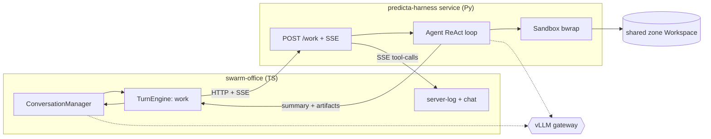

# SPEC — F5: work turns (agents that DO, not just talk)

> Phase: **specify** (Cross-Module → State-First + Architecture). Driver repo:
> `swarm-office` (TS). Backend: `predicta-harness` (Python sandbox, separate repo).
> Date: 2026-06-22. Author: Albert + Claude. Status: draft for approval. Next: /02-design.
>
> Binding prior art (NOT to reinvent): F4's pluggable **`TurnEngine`** in
> `ConversationManager` (the seam), F4b's **`move`** tool + tool registry, and
> predicta-harness's **`Sandbox` interface + `sandbox_tools`** (Workspace + LocalSandbox +
> BubblewrapSandbox), already verified against the real vLLM.

## 1. User story & guiding principle

> The office agents converse (F4) and, **based on that conversation, decide on their own
> to DO real work** — write code, run it, generate information — in a sandbox with a
> general-purpose toolset. The output is higher quality because it's **grounded in
> execution** (real artifacts that run), not just asserted in chat.

**Guiding principle — EMERGENT agency, not a scripted task.** v1 does NOT hardcode "the
task". It ships the *mechanism*: an agent can, mid-round, **decide** to work and state its
**own free-form goal**, and the substrate (sandbox + file/code tools, a persistent shared
workspace) lets it accomplish **whatever it decided**. The conversation drives the goal;
the harness executes it open-endedly via a ReAct loop.

## 2. Scope

**In:**
- A **work turn**: an agent, during a round, calls a `do_work(goal)` tool (it decides the
  goal). That turn delegates to a **predicta-harness HTTP service** that runs an open-ended
  ReAct loop with the full sandbox toolset, then returns a summary + the artifacts.
- The bridge: **predicta-harness as a small local HTTP daemon** (`POST /work`, **SSE** stream
  of tool-calls for live observability). office ↔ harness over HTTP (both already speak the
  same OpenAI-compatible vLLM).
- A **shared per-zone Workspace** (the "project repo" of that office zone) so work persists
  and multiple agents CAN read/write the same files.
- **Surfacing in the UI**: the existing `server-log` streams each work tool-call; the NPC
  reports the result in chat; the avatar walks to a "work" zone (reusing the `move` tool).
- Reuses F4: one-in-flight turn discipline, human STOP (halts a work turn too), consensus.

**Out (deferred):** real external tools (email/browser/MCP) beyond the sandbox; auth /
multi-tenant on the service; cross-agent review *workflow* (the shared workspace ENABLES it,
but the orchestrated "A writes → B reviews" loop is F5.x); >handful of agents; workspace
persistence guarantees beyond "a directory on the VM".

## 3. Architecture



```text
  swarm-office (TS)                 predicta-harness service (Py)
  ┌───────────────┐  POST /work     ┌──────────────────────────┐
  │ Conversation  │ ──────────────► │ /work  → Agent ReAct loop │
  │  Manager      │  ◄ SSE tool-calls│         → Sandbox(bwrap)  │──► shared
  │  TurnEngine   │ ◄ summary+arts  │                           │   zone Workspace
  └──────┬────────┘                 └─────────────┬─────────────┘   (the "repo")
   server-log streams                              │
   the work tool-calls          both call the SAME vLLM gateway (one brain)
```

## 4. States — the work-turn lifecycle

| State | Description |
|-------|-------------|
| `discussing` | normal F4 speak turns; agents coordinate (cheap) |
| `decided` | an agent called `do_work(goal)` → a work turn is queued (goal is agent-stated) |
| `working` | the harness ReAct loop runs; tool-calls stream to `server-log`; avatar at work zone |
| `reporting` | loop done → the NPC speaks a summary; artifacts persisted in the zone workspace |
| `done` | control returns to the round (next speak turn / consensus) |
| `failed` | harness unreachable / sandbox error / timeout → degrade to a chat line, round continues |
| `stopped` | human STOP mid-work → the in-flight work turn is the last; partial artifacts kept |

```text
 discussing ──do_work(goal)──► decided ──► working ──► reporting ──► done ─┐
     ▲                                        │  │                          │
     └──────────────── next turn ─────────────┘  ├─ STOP ─► stopped         │
                                                 └─ error/timeout ─► failed ─┘
```

## 5. Interface contracts

### 5.1 Office: the `do_work` tool (agent-facing)
```
do_work(goal: string)   # the agent DECIDES to work and states its own goal in free text
  → the work TurnEngine handles it; the agent's spoken line becomes the work summary
```

### 5.2 Bridge: predicta-harness HTTP service
```
POST /work
  body: { agentKey: string, goal: string, workspace: string, model: string, maxSteps?: int }
  response (SSE stream of events, then a final result):
    event: tool   data: { name, input, output }     # one per executed tool (→ server-log)
    event: step   data: { n, text }                 # assistant text per loop step (optional)
    event: done   data: { summary: string, files: string[], steps: int, usage: {...} }
    event: error  data: { message: string }
GET /healthz → 200 when the service + sandbox are ready
```

### 5.3 Shared zone Workspace
```
one Workspace per office zone (e.g. /srv/office-ws/<zoneId>) — the agents' shared "repo".
write_file/run_code/read_file/list_files operate here (predicta-harness sandbox tools).
Persists across work turns and rounds (a real directory).
```

## 6. Domain rules & constraints

- **R1 — Emergent goal:** the work goal is the agent's free-form text (decided in-round),
  never a hardcoded task. The harness loop is open-ended (any code/files), bounded by `maxSteps`.
- **R2 — One work turn in flight** (extends F4's one-in-flight): the manager runs at most one
  `do_work` at a time; a work turn blocks new turns until it returns (the round waits).
- **R3 — Real isolation server-side:** the harness sandbox is `BubblewrapSandbox` on the VM —
  no network, no host FS, only the zone workspace writable, timeout (the F4-sandbox guarantees).
- **R4 — Observable:** every executed tool streams to the `server-log` (SSE → existing panel);
  a work turn is never a silent black box.
- **R5 — Human STOP halts work** too (F4 §4.5): STOP aborts the in-flight loop; partial
  artifacts in the workspace are kept (not rolled back).
- **R6 — Degrade, don't crash:** if the harness service is unreachable or errors, the work
  turn becomes a plain chat line ("couldn't complete the work: <reason>") and the round
  continues — idle/discuss path is unaffected.
- **R7 — Bounded cost:** `maxSteps` per work turn + one-in-flight + the existing runaway/STOP.
- **R8 — Shared workspace, single writer at a time:** because R2 serializes work turns, two
  agents never write the workspace concurrently in v1 (no locking needed yet).

## 7. Error cases & recovery

| Case | Behaviour | Recovery |
|------|-----------|----------|
| harness `/work` unreachable | work turn → chat line "no pude trabajar: servicio caído" | round continues (R6); operator starts the daemon |
| sandbox infra error (bwrap) | harness `event: error`; work turn reports the failure | falls back to discuss; fix the VM sandbox |
| ReAct hits `maxSteps` | harness returns a partial summary + files-so-far | the agents can `do_work` again to continue |
| code in sandbox errors | NORMAL: the loop reads stderr and iterates (F4-sandbox) | self-corrects within the loop |
| work timeout (whole turn) | manager aborts, marks `failed`, logs loudly | retry or discuss |
| STOP during work | `stopped`; partial artifacts kept | human re-seeds / re-assigns |

## 8. Acceptance criteria

- [ ] **AC1 (emergent work):** seed a round whose topic needs real output (e.g. "computad y
  guardad la secuencia de Fibonacci hasta N"). The agents discuss, then an agent calls
  `do_work` with **its own goal** → the harness loop **writes a file and runs code** → the
  NPC reports a result that MATCHES the executed output (grounded, not asserted).
- [ ] **AC2 (artifact persists):** the file created lives in the **zone workspace** and is
  still there next round; a second `do_work` can read/extend it.
- [ ] **AC3 (observable):** every work tool-call appeared in the `server-log` panel (SSE),
  live, during the turn.
- [ ] **AC4 (isolation):** on the VM the work ran in `bwrap` — a probe goal that tries network
  / host-FS is blocked (inherited from the F4-sandbox isolation tests).
- [ ] **AC5 (degrade):** with the harness daemon stopped, a `do_work` turn becomes a chat line
  and the round still finishes — no crash.
- [ ] **AC6 (one brain):** the harness drives the work with the SAME vLLM the office uses
  (verified end-to-end: a real Qwen already drove write_file+run_code).

## 9. Validation strategy

- **Harness service (Py):** unit/integration on `/work` with a scripted provider (no LLM) —
  asserts SSE `tool`/`done` events + artifact written; reuse the F4-sandbox test idiom.
- **Office work TurnEngine (TS):** the F4 probe pattern — inject a work engine that returns a
  canned `{summary, files}`; assert the round handles the work-turn states (decided→working→
  reporting→done; STOP→stopped; error→failed) deterministically, no live service.
- **E2E (real):** the AC1 scenario against the live vLLM + the harness daemon on the VM,
  driven through the office UI (`/dev-browser`): seed → discuss → do_work → server-log streams
  tool-calls → NPC reports the real result → file in the zone workspace.
