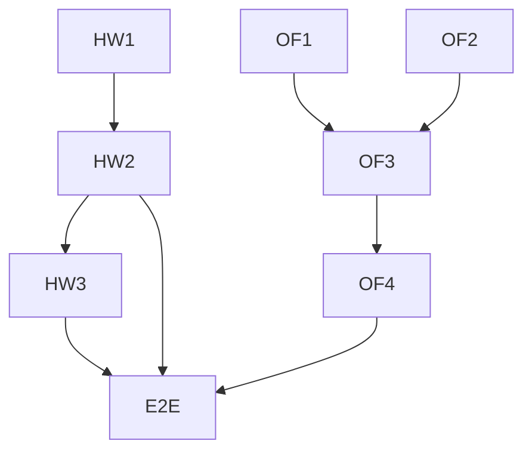

# TASKS — F5: work turns

> Phase: tasks. Reads SPEC + DESIGN. Two repos. TDD. Critical path = harness `/work`
> (testable now with LocalSandbox + a scripted provider) → office work-turn (F5.probe,
> deterministic) → daemon + E2E on dev-instance.

## Ordered tasks

| # | Task | Repo | Test (RED first) | Depends |
|---|------|------|------------------|---------|
| HW1 | service skeleton: `POST /work` (returns `done` JSON) + `GET /healthz` | predicta-harness (Py) | `tests/test_service.py` (scripted provider + LocalSandbox) | — |
| HW2 | SSE: stream `event:tool` per on_tool, then `event:done`/`error` | predicta-harness | `tests/test_service.py` (parse the event stream) | HW1 |
| HW3 | daemon entry `python -m predicta_harness.service` + backend select (Local/Bubblewrap by env) | predicta-harness | `GET /healthz` 200 | HW2 |
| OF1 | `do_work(goal)` tool def in `tools.ts` (offered to the model) | swarm-office (TS) | `tsc` | — |
| OF2 | `workClient.ts` — `node:http` POST + SSE parse + AbortSignal | swarm-office | `tsc` (+ unit if cheap) | — |
| OF3 | `ConversationManager.runWorkTurn` + states + degrade (R6) + STOP-abort; `F5.probe.ts` | swarm-office | `F5.probe.ts` (inject stub workClient; assert states) | OF1, OF2 |
| OF4 | `OfficeRoom` wiring: inject workClient (`HARNESS_URL` env) + zone→workspace | swarm-office | `tsc` + boot smoke | OF3 |
| E2E | harness daemon on dev-instance (bwrap) + office; AC1 via `/dev-browser` | both | manual E2E | all |

## Dependency graph & critical path



```text
 HW1 ─► HW2 ─► HW3 ─────────────┐
 OF1 ─┐                         ├─► E2E (dev-instance + office UI)
 OF2 ─┴─► OF3 ─► OF4 ───────────┘
 (harness side testable NOW with LocalSandbox; office side via F5.probe — both offline)
```

- **Critical path:** HW1 → HW2 (harness `/work` + SSE, verifiable locally) → OF3 (office work
  turn, F5.probe) → OF4 → E2E.
- **Parallelizable:** HW1–HW2 (Py) and OF1–OF2 (TS) are independent.
- **AC mapping:** AC1/AC2 ← HW2+OF3+E2E · AC3 ← HW2 (SSE)+OF3 (server-log) · AC4 ← HW3
  (BubblewrapSandbox) · AC5 ← OF3 (degrade) · AC6 ← HW2 (real vLLM, already proven).

## Notes for /04-implement
- Harness `/work` + tests run anywhere (LocalSandbox + scripted provider); the daemon on the
  VM uses BubblewrapSandbox. Start there — it's the most self-contained, verifiable-now piece.
- Office work turn is a SPECIAL case in `runRound` (async await of the HTTP), not the sync
  `executeToolCall`; move/yield_turn stay sync. F5.probe stubs workClient → deterministic.
- No new runtime deps either side (stdlib `http.server` / `node:http`). Daemon on dev-instance
  via a systemd unit (the /vm long-process rule), with the office degrading if it's down.
